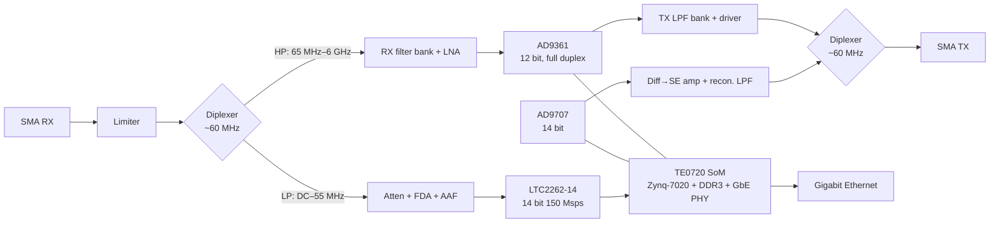

# scalingRF

An open-hardware, full-duplex software-defined radio covering **1 kHz to 6 GHz** with **12-bit or better** converters, one TX port and one RX port.

It started as "a full-duplex HackRF" and ended up as a different design: the HackRF's half-duplex limits come from its architecture (TDD transceiver, a single shared mixer, switched RF path, USB 2.0), so instead of patching it, scalingRF uses a full-duplex RFIC for VHF–6 GHz and a separate direct-sampling path for HF, both behind the same two connectors.

> **Status:** architecture defined, no schematics yet. See [docs/07-open-items.md](docs/07-open-items.md) for what still needs verifying before KiCad work starts.

## Target specification (v0)

| Parameter | Target |
|---|---|
| Frequency range | 1 kHz – 6 GHz, TX and RX |
| Duplex | Full duplex, independent TX and RX frequencies |
| Resolution | 12-bit (AD9361), 14-bit (HF path) |
| RF ports | 2 × SMA: one TX, one RX. No per-band connectors |
| Instantaneous bandwidth | ~10–20 MHz each direction simultaneously (limited by Gigabit Ethernet) |
| Host interface | Gigabit Ethernet, embedded Linux on the device |
| Reference | 40 MHz VCTCXO, optional 10 MHz in/out and PPS |

## Architecture at a glance



Three signal paths share two connectors:

- **HF, 1 kHz – ~55 MHz:** direct sampling. DC-coupled throughout, no transformers, which is what makes 1 kHz possible.
- **VHF–SHF, ~65 MHz – 6 GHz:** AD9361, with switched filter banks, LNA and TX driver.
- **Crossover:** a passive diplexer on each port. The AD9361 is specified from 70 MHz but usable lower; the HF path at 150 Msps reaches ~60 MHz, giving overlap.

## Key choices

| Block | Choice | Why |
|---|---|---|
| RFIC | AD9361 | 70 MHz–6 GHz natively, full duplex with separate TX/RX PLLs, 2×2, mature Linux/IIO + HDL ecosystem |
| Digital | Trenz TE0720 (Zynq-7020) | No DDR3 layout on the carrier, 152 PL I/O, per-bank VCCIO set by the carrier |
| AD9361 interface | CMOS dual-port full duplex, 1.8 V | Same approach as ADALM-PLUTO; one bank, reuse of ADI HDL |
| HF ADC | LTC2262-14 (fallback LTC2261-14) | 14 bit, 150 Msps, 1.8 V CMOS outputs |
| HF DAC | AD9707 | 14 bit, 175 MSPS, 1.7–3.6 V supply, pin-strap configurable |
| Clocking | 40 MHz VCTCXO + LMK03328 + ADF4002 | Integer-N 150 MHz for HF converters, optional disciplining to external 10 MHz |

Full reasoning, alternatives considered and prices at the time of the decision are in [docs/03-decisions.md](docs/03-decisions.md).

## Repository layout

```
docs/               Design documentation
  01-requirements.md
  02-architecture.md
  03-decisions.md   Decision log with alternatives and rationale
  04-digital.md     SoM, bank plan, interfaces
  05-clocking.md    Reference and clock tree
  06-rf-frontend.md RX/TX chains, diplexer, filter banks
  07-open-items.md  Things to verify before schematics
hardware/
  pinmap/           Bank/signal allocation (CSV)
  kicad/            Carrier board (not started)
sim/                Simulations (diplexer done; see docs/07 for the plan)
gateware/           Zynq PL design (not started)
software/           Yocto layer, drivers, host tools (not started)
```

## Development plan

1. Simulate and verify every block before buying anything (plan in docs/07-open-items.md). Diplexer: done, rev 1.
2. Bring up gateware and software on an off-the-shelf AD936x + Zynq board (Pluto+/LibreSDR class) while hardware is designed.
3. Prototype the diplexer and the HF front end as separate small boards.
4. Carrier board rev A.

## License

Hardware: CERN-OHL-P v2. See [LICENSE](LICENSE).
