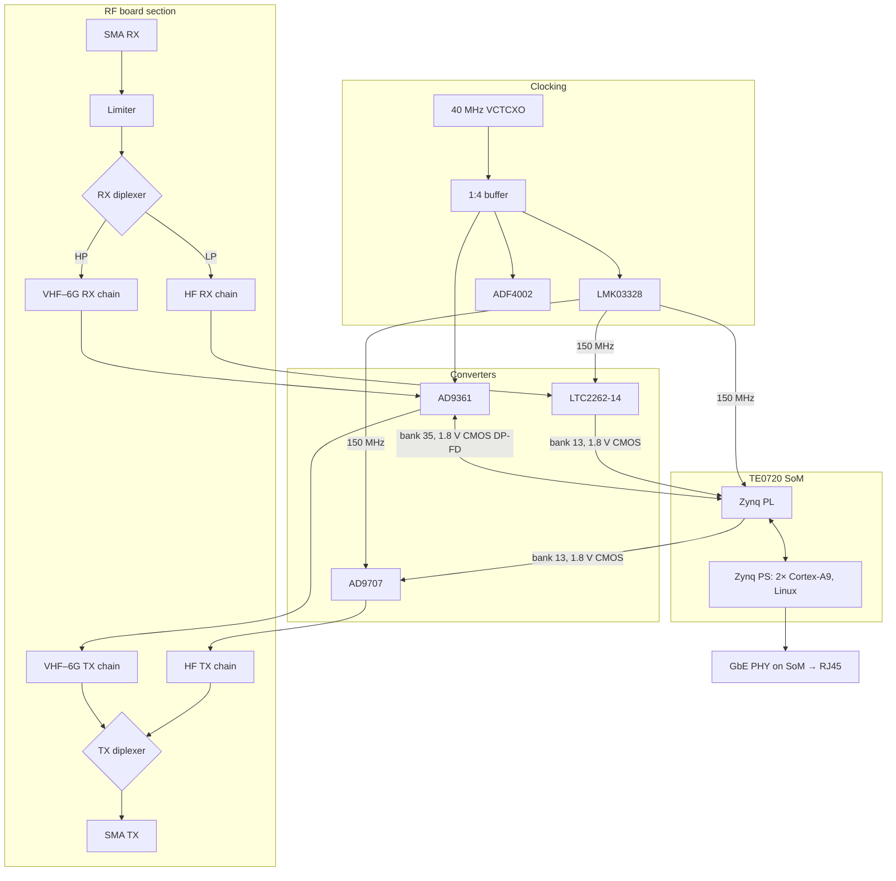

# 02 — Architecture

## Why not modify the HackRF

The HackRF (One and Pro) is half-duplex by construction:

- **MAX2831** is a TDD Wi-Fi transceiver with a single PLL shared by TX and RX.
- **RFFC5072** is a single synthesizer/mixer, switched between the TX and RX paths.
- The RF path is a chain of switches into one port, with shared filters.
- **USB 2.0** carries ~35–40 MB/s, which one direction at 20 Msps already fills.
- 8-bit ADC (MAX5865).

Replacing the transceiver and AFE with a full-duplex part pulls the FPGA, MCU, USB and clocking with it, so what remains of the HackRF is mostly the front-end concept. scalingRF keeps that concept and starts the rest fresh.

## Top level

## Signal paths

| Path | Range | Converter | Coupling |
|---|---|---|---|
| HF | 1 kHz – ~55/60 MHz | LTC2262-14 / AD9707 at 150 Msps | DC-coupled end to end |
| VHF–6 GHz | ~65 MHz – 6 GHz | AD9361 (one RX input, one TX output) | AC, baluns |

Both paths are active at the same time. The diplexers split and combine them passively, so HF and VHF can even be used simultaneously on the same port.

## Data path

- AD9361 ↔ PL: CMOS dual-port full duplex, 12 bit, ADI `axi_ad9361` IP.
- HF ADC → PL, PL → HF DAC: parallel full-rate CMOS, 14 bit.
- PL ↔ PS: AXI DMA into DDR3; Linux IIO drivers expose the streams.
- PS ↔ host: Gigabit Ethernet (libiio network backend, SoapySDR).

The link is the bottleneck: ~110 MB/s each way means ~25 Msps per direction in theory, less in practice with the PS handling the network stack. Decimation/interpolation in the PL is the way to use the converters' full rate while streaming a narrower band.

## Physical partitioning (intended)

- Separate shielded compartments for the RX RF section, the TX RF section, the HF analog section and the digital/power section.
- AD9361 placed right next to the SoM connector carrying bank 35 (single-ended 1.8 V CMOS through a board-to-board connector; keep it short).
- Clock section isolated from switching regulators.
