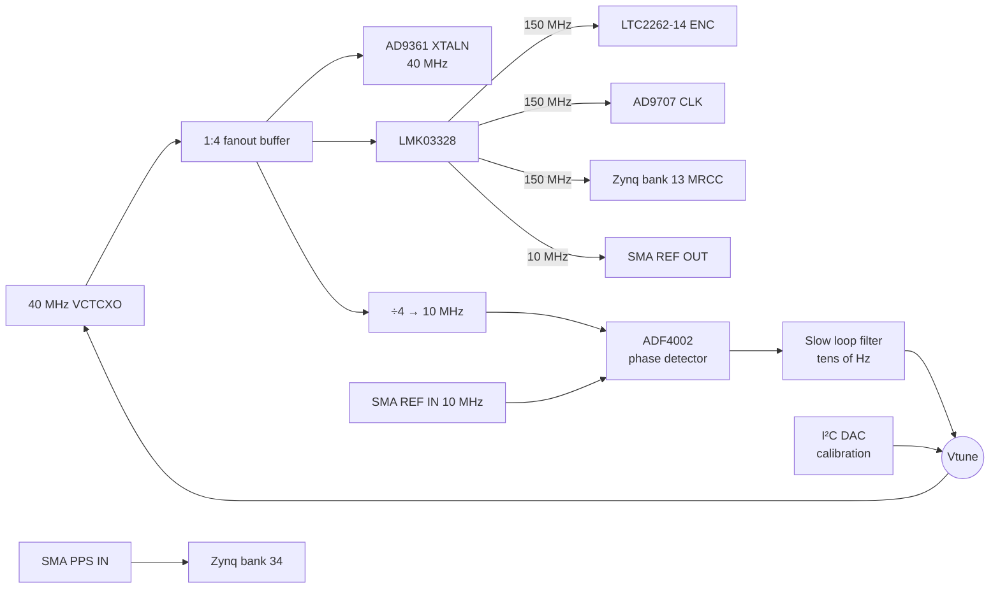

# 05 — Clocking

## Tree

## Reference: 40 MHz VCTCXO

- Feeds the AD9361 directly, as on the Pluto. The AD9361 RF PLLs multiply this reference up to the LO, so the VCTCXO's **phase noise** shows up on the LO; choose for phase noise first, ppm second.
- The AD9361 XTALN input has its own level requirement; it does not take 3.3 V CMOS directly. Check the datasheet and match the buffer output accordingly.

## HF converter clocks: LMK03328

- Two fractional-N PLLs with integrated VCO (4.8–5.4 GHz), up to 8 outputs in any mix of LVDS / LVPECL / HCSL / LVCMOS, output supply 1.8/2.5/3.3 V, I²C / pin / EEPROM configuration, 100 fs RMS typical jitter above 100 MHz.
- Planned frequency plan (PLL1): 40 MHz in, VCO 4800 MHz (N = 120, integer), outputs 150 MHz (÷32) ×3 and 10 MHz (÷480). **Confirm the divider chain in TICS Pro.**
- Availability: shown out of stock on TI's own store at the time of writing. Check distributors before committing. Alternative families: Si5332, CDCE6214 (check jitter at 150 MHz).

### Jitter budget

Jitter-limited SNR = −20·log₁₀(2π · f_in · t_j).

For ~72 dB at 60 MHz input: t_j ≤ ~0.65 ps RMS total. ADC aperture jitter ~0.17 ps, LMK03328 ~0.1–0.17 ps → comfortable margin.

## External reference: ADF4002

Same approach as the USRP B2xx: a narrow-bandwidth PLL steers the VCTCXO to an external 10 MHz.

- External reference present: loop locks the VCTCXO to it. Long-term stability from the external source, short-term phase noise from the VCTCXO.
- No external reference: charge pump tri-stated; VCTCXO tune voltage set by an I²C DAC from a stored calibration value.

REF IN, REF OUT and PPS are optional timing connectors, not RF ports, so they do not conflict with the two-antenna requirement. Minimum recommendation: keep REF IN (multi-board sync, GPSDO).

## Coherence

AD9361, HF ADC and HF DAC all derive from the same 40 MHz reference. Sample rates are independent (e.g. AD9361 at 30.72 Msps, HF at 150 Msps); timestamps in the PL can be aligned using PPS.
