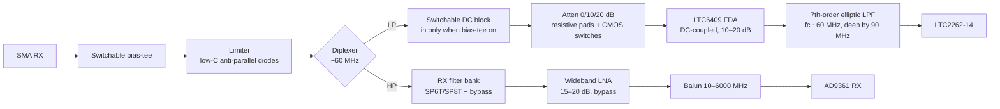
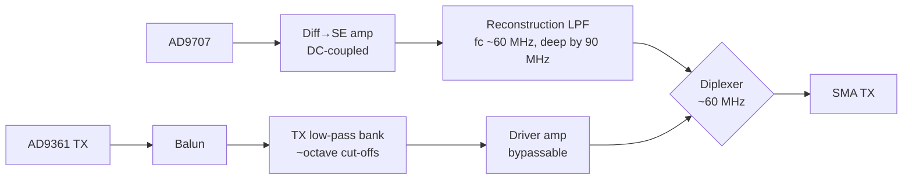

# 06 — RF front end

Two connectors, each feeding a diplexer that splits HF (DC–~55 MHz) from VHF–6 GHz (~65 MHz–6 GHz).

## RX

### HF RX

- **Attenuator:** must work from DC, so resistive pads switched by CMOS switches (ADG918/919 family), not typical RF step attenuators, which are specified from kHz/MHz upwards.
- **FDA:** LTC6409, DC-coupled, fixed gain ~10–20 dB, sets the ADC input common mode. ADI's DC1760A demo board (LTC2261-14 + LTC6409) is the reference.
- **Anti-alias filter:** at 150 Msps anything at 90 MHz folds onto 60 MHz, so the filter must be well down by 90 MHz.
- **No LNA:** at HF, atmospheric noise dominates; overload is the real problem. Same approach as direct-sampling HF receivers.

### VHF–6 GHz RX

- **Filter bank:** 5–6 roughly octave bands plus bypass, e.g. 65–150 / 150–300 / 300–700 / 700–1500 / 1500–3000 / 3000–6000 MHz. Two SP6T/SP8T SOI switches rated to 6 GHz; budget ~1 dB loss per switch at the top of the band.
- **LNA:** wideband, 15–20 dB, with bypass. HackRF One uses MGA-81563 — a reference point, but compare current parts for better IP3.
- **Filter before LNA** (see D10).
- **One AD9361 input** with a 10–6000 MHz balun (TCM1-63AX+ class, as on ADI's FMCOMMS boards). Using RX B/C inputs as well is possible but adds complexity for little gain.

## TX

### HF TX

- DAC current outputs → DC-coupled differential-to-single-ended amplifier (no transformer: it would not reach 1 kHz).
- Reconstruction LPF: image of a 60 MHz tone sits at 90 MHz.
- sinc roll-off at 60 MHz with 150 MSPS ≈ 2.4 dB; compensate in the PL.
- Output ~0 dBm. No HF PA in scope.

### VHF–6 GHz TX

- **Low-pass bank** for harmonics, cut-offs around 150 / 300 / 600 / 1200 / 2400 / 4800 MHz plus an unfiltered path for 4.4–6 GHz. The AD9361 output alone is not clean enough to drive an antenna.
- **Driver** after the filters, bypassable, targeting ≥ +10 dBm where the AD9361 alone falls short.
- RX and TX filter banks are independent. Full duplex rules out sharing.

## Diplexer — highest-risk block

Simulated in [`sim/diplexer/`](../sim/diplexer/README.md), rev 2, with Coilcraft 0805HP manufacturer models, board parasitics and Monte Carlo.

- LP: 0805HP-271 / 82 pF / 0805HP-271 / 62 pF / 0805HP-56N
- HP: 33 pF / 0805HP-82N / 30 pF / 0805HP-101 / 110 pF

Result (worst 1 % of Monte Carlo): LP ≤ 1 dB to 49 MHz, HP ≤ 1 dB from 67 MHz to 6 GHz (≤ 0.75 dB above 100 MHz), return loss ≥ 11 dB. **Crossover ~57 MHz with ~4 dB loss** — inherent to sharing one port.

Layout constraints from the sensitivity analysis: ≤ 0.8 nH to ground per shunt part (two vias), 0.5–1.5 mm between HP-arm parts, inductor parasitic C ≤ 0.15 pF.

Open: inductor models are extrapolated above 2 GHz for the HP shunt parts → first thing to measure on a prototype. Capacitors still on a generic model.

## Bias-tee

Switchable. When on, a series DC block is switched into the HF LP arm, so 1 kHz operation and active-antenna bias are mutually exclusive (D9).

## Control

All band/attenuator/bypass/bias-tee selections go through two I²C GPIO expanders (one in the RX section, one in the TX section), ~15 lines total. If sample-synchronous band switching is ever needed, the filter-bank selects move to bank 33.

## Isolation

- Separate shielded compartments for RX RF, TX RF and HF analog.
- Board-level TX→RX isolation target: > 60 dB (to be refined). Same-band full duplex isolation is set mostly by antenna separation.
