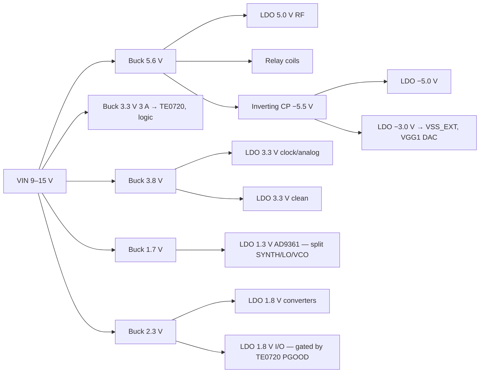

# Power tree — rev 0 (inventory and architecture)

**Status:** load inventory with sources, proposed architecture, input budget, sequencing and noise requirements. **11 of 21 loads are not yet datasheet-verified** (`loads.json → unverified`); regulators not chosen; efficiencies assumed.

## Loads by rail and noise class (`loads.py`)

| Rail | Class | Current | Main loads |
|---|---|---|---|
| +5.0 V | rf-clean | 323 mA | LTC6433-15 (95 mA), HMC8410 (65 mA), LMH6702 +, VHF TX driver (TBD) |
| +3.3 V | digital | 930 mA | **TE0720 (2–3 W)**, AD9361 GPO, logic |
| +3.3 V | rf-clean | 265 mA | LMK03328, VCTCXO, LTC6409 |
| +3.3 V | clean | 11 mA | PE42582 ×2, ADF4002, DSA |
| +1.8 V | rf-clean | 113 mA | LTC2262-14, AD9707 |
| +1.8 V | clean | 20 mA | AD9361 VDD_INTERFACE (with Zynq banks 13/35) |
| +1.3 V | rf-clean | 1.0 A (budget) | **AD9361** (1R1T FDD 345–490 mA per datasheet; 2R2T higher) |
| −5.0 V | rf-clean | 13 mA | LMH6702 − |
| −3.0 V / −2 V | clean | ~1 mA | PE42582 VSS_EXT, HMC8410 VGG1 (via DAC) |

Total at the loads: **7.2 W**.

## Architecture (`tree.py`)

Switchers bring the voltage close to the target; **low-noise LDOs post-regulate everything that touches RF, the data converters or the clock**.



Budget (bucks 88 %, charge pump 85 % assumed): **input 9.1 W, 0.76 A at 12 V, 79 % overall**. Largest single loss: the AD9361 1.3 V LDO (0.4 W) — the price of a clean core supply.

**Input**: 9–15 V DC as baseline. PoE is attractive (D2: device near the antenna, one cable): 802.3af (12.95 W at the PD) would be marginal once the PD converter and the undesigned TX chain are added → **PoE+ (802.3at)** if PoE is adopted.

## Requirements collected from the blocks

**Sequencing**
- TE0720: VCCIO for banks 13/33/34/35 derived from the module's 3.3 V output or gated by its Power Good; bank 34 ≥ 1.25 V for the Zynq to leave reset.
- HMC8410: VGG1 = −2 V **before** VDD = 5 V; reverse at power-down. Hardware default must hold VGG1 at −2 V until firmware calibrates IDQ (−3 V rail must come up before the 5 V RF rail).
- LMH6702 / LTC6433 / HMC8410 decoupling per datasheets (LMH6702: 0.1 µF across V+ to V−).

**Noise**
- AD9361 1.3 V split: separate low-noise LDO for SYNTH / LO / VCO nets (ADI UG-673).
- VCTCXO and LMK03328 on their own LDO (phase noise).
- **Spur control**: switchers ≥ 2 MHz and **synchronised to a clock derived from the reference**, so their spurs sit at known frequencies; LDO PSRR at the switching frequency and its harmonics sized per rail (analysis next).

## Next

1. Verify the 11 unverified loads (AD9361 2R2T FDD current, LTC6409, AD9707, LMK03328, LMH6702, VCTCXO, TX chain once designed).
2. Choose regulators; PSRR/noise budget per rail (what ripple each sensitive load tolerates → required LDO PSRR at the buck frequency).
3. Sequencer design (hardware-safe defaults).

## Reproduce

```
python3 loads.py   # inventory by rail and class
python3 tree.py    # tree budget
```
