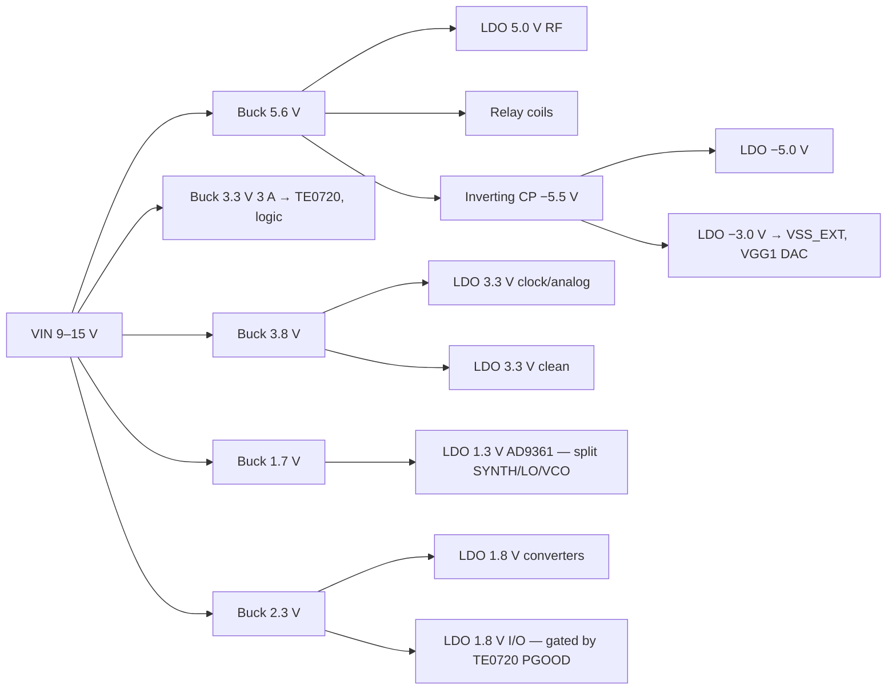

# Power tree — rev 3

**Status (rev 3):** AD9361 1.3 V regulators chosen and ripple-budgeted; two-stage bus introduced. Loads 7.7 W, input **10.2 W (0.85 A at 12 V), 75 %**. 9 loads still unverified; other regulators not chosen.

## Rev 3 — AD9361 1.3 V: regulators and ripple budget

**No AD9361 supply-ripple sensitivity figure** (spur dBc per mV) was found in accessible ADI material; UG-570 discusses supply-induced phase noise with plots, not a number. **Not invented.** Criterion anchored on what ADI validated instead: LO phase noise was measured with the ADP1755, whose own output noise is ~23 µV rms → the switching ripple reaching the AD9361 must sit far below that (target ≤ 2 µV pp).

**LDO: ADP1762 ×2 instead of ADP1755.** The ADP1755 (ADP1754/1755 datasheet: 1.2 A, VIN 1.6–3.6 V) would run at its **minimum input** from a 1.6 V buck, and its datasheet gives no PSRR at 1 MHz or at low headroom. The ADP1762 (2 A, VIN 1.10–1.98 V, designed for low headroom) has **~2 µV rms noise (~10× lower)** and specifies **39 dB at 1 MHz** with 1.6 V in / 1.3 V out at 2 A. (An aggregator page labels ADP1762-like specs as "ADP1755"; the official ADP1754/1755 datasheet is used here.)

**Ripple** (`ripple_ad9361.py`; buck 10 mV pp at 1.2 MHz — both ASSUMED, to verify on the ADP2164 datasheet):

| Filtering | Ripple at AD9361 | vs 23 µV rms |
|---|---|---|
| LDO only (39 dB) | 112 µV pp | ✘ |
| + LC post-filter, fc 300 kHz (24 dB) | 7.0 µV pp | ✘ |
| **+ LC post-filter, fc 120 kHz (40 dB)** | **1.1 µV pp** | ✔ |

→ **ADP2164 → damped LC post-filter (fc ≈ 120 kHz) → 2× ADP1762 → AD9361 1.3 V.**

**Two-stage bus.** The ADP2164 accepts ≤ 6.5 V, so it cannot sit on the 9–15 V input: point-of-load bucks now run from the **5.6 V intermediate bus**. The largest load (TE0720, 3 W) gets a **wide-input buck directly from VIN** to avoid double conversion there (10.7 W → 10.2 W).

**Verified (ADP2164 datasheet):** fixed 600 kHz / 1.2 MHz, adjustable 0.5–1.4 MHz, **SYNC input 0.5–1.4 MHz**; 2.7–6.5 V input.

**Requirement corrected.** Rev 0 required switchers "≥ 2 MHz and synchronised". The ≥ 2 MHz part had no justification: with AD9361 channel bandwidths up to 56 MHz, a spur at a 1.2 MHz or a 2 MHz offset is in band either way. What matters is **synchronisation** (spurs at known, fixed frequencies) and **ripple attenuation** (handled by the LC + LDO budget above). The ≥ 2 MHz rule is withdrawn; synchronisation stays.

**Sync clock:** 150 MHz / 120 = **1.25 MHz**, generated in the PL from the 150 MHz HF converter clock (reference-coherent), inside the ADP2164 range. Until the PL is configured the buck free-runs at its RT setting. At 1.25 MHz the LC post-filter attenuates slightly more than at 1.2 MHz; the ripple budget holds.

**New open issue:** harmonics of 1.25 MHz fall **inside the HF band** every 1.25 MHz. The HF path is direct-sampling and DC-coupled, so it is the most exposed. Its rails are LDO post-regulated, but magnetic/radiated coupling from buck inductors into the HF front end is a layout and shielding matter → needs its own analysis (spur level at the HF input vs the HF noise floor).

---

# Rev 2

## Rev 2 — correction: the whole AD9361 1.3 V goes through LDOs

Rev 1 adopted "a 1.2 A buck directly for the main 1.3 V + a 300 mA LDO for the synth nets", read from a text-extracted datasheet figure. **That was a misreading.** ADI documents two solutions, and in both the entire 1.3 V is LDO-regulated:
- **Low-noise (datasheet Fig. 74):** ADP2164 buck → **two ADP1755 LDOs** with the 1.3 V split between them. **Adopted.**
- Space-optimised: ADP5040 (1.2 A buck + two 300 mA LDOs, PSRR > 60 dB) + ADP1755; the ADP5040 LDOs feed VDD_INTERFACE and VDD_GPO, the ADP1755 feeds the 1.3 V.

Also from ADI:
- UG-570 ("phase noise effects from power supply variations"): ADP1755 gives the best LO phase noise; **the highest LO frequencies are the most sensitive** (smallest VCO divide ratios).
- Sequencing: only VDD_GPO has a rule (≥ the 1.3 V rail, rising as fast). **GPO and AuxDAC are unused here (control is via I²C expanders) → VDD_GPO tied to 1.3 V**, removing that rule and the 3.3 V GPO load.

Effect: the 86 % of rev 1 came from the misreading. Correct figure: 9.7 W in, 79 %. The ADP1755 LDOs (1.6 → 1.3 V) dissipate 0.31 W; their PSRR at 0.3 V headroom must be checked against the ADP2164 switching frequency.

---

# Rev 1 **9 loads still unverified** (`loads.json → unverified`); regulators not chosen; efficiencies assumed.

## Rev 1 — verified loads

- **LMK03328** was estimated at 200 mA for the whole part: the datasheet gives IDD-IN 61, PLL1 144, PLL2 110, DIG 41 mA (typ), and 60–92 mA per output group. With PLL2 off and two output groups: **~246 mA core at 3.3 V + ~184 mA outputs** (VDDO can be 1.8 V → used here; check that the chosen output formats are valid at 1.8 V). About **2× the estimate**. Supply-noise rejection is good (PSNR −80 dBc).
- **AD9361 1.3 V**, FDD 800 MHz, 2R2T, 20 MHz BW: **1020 mA** with TX at +7 dBm, 730 mA at −27 dBm (datasheet table) → the 1.0 A budget was right, barely; wider bandwidths draw more.
- ~~The AD9361 datasheet shows ADI's supply reference: a 1.2 A buck for the main 1.3 V and a 300 mA LDO for the sensitive nets~~ — **misreading, corrected in rev 2.**

Result: loads **7.7 W**, input **8.9 W (0.74 A at 12 V), 86 %**.

Open trade-off: the 300 mA synth LDO fed from 2.3 V loses 0.3 W; lowering its input improves efficiency but **LDO PSRR drops at low headroom** → decided with the actual regulator's PSRR-vs-headroom data.

---

# Rev 0 (inventory and architecture)

## Loads by rail and noise class (`loads.py`)

| Rail | Class | Current | Main loads |
|---|---|---|---|
| +5.0 V | rf-clean | 323 mA | LTC6433-15 (95 mA), HMC8410 (65 mA), LMH6702 +, VHF TX driver (TBD) |
| +3.3 V | digital | 930 mA | **TE0720 (2–3 W)**, AD9361 GPO, logic |
| +3.3 V | rf-clean | 265 mA | LMK03328, VCTCXO, LTC6409 |
| +3.3 V | clean | 11 mA | PE42582 ×2, ADF4002, DSA |
| +1.8 V | rf-clean | 113 mA | LTC2262-14, AD9707 |
| +1.8 V | clean | 20 mA | AD9361 VDD_INTERFACE (with Zynq banks 13/35) |
| +1.3 V | rf-clean | 1.0 A (budget) | **AD9361** (1R1T FDD 345–490 mA per datasheet; 2R2T higher) |
| −5.0 V | rf-clean | 13 mA | LMH6702 − |
| −3.0 V / −2 V | clean | ~1 mA | PE42582 VSS_EXT, HMC8410 VGG1 (via DAC) |

Total at the loads: **7.2 W**.

## Architecture (`tree.py`)

Switchers bring the voltage close to the target; **low-noise LDOs post-regulate everything that touches RF, the data converters or the clock**.



Budget (bucks 88 %, charge pump 85 % assumed): **input 9.1 W, 0.76 A at 12 V, 79 % overall**. Largest single loss: the AD9361 1.3 V LDO (0.4 W) — the price of a clean core supply.

**Input**: 9–15 V DC as baseline. PoE is attractive (D2: device near the antenna, one cable): 802.3af (12.95 W at the PD) would be marginal once the PD converter and the undesigned TX chain are added → **PoE+ (802.3at)** if PoE is adopted.

## Requirements collected from the blocks

**Sequencing**
- TE0720: VCCIO for banks 13/33/34/35 derived from the module's 3.3 V output or gated by its Power Good; bank 34 ≥ 1.25 V for the Zynq to leave reset.
- HMC8410: VGG1 = −2 V **before** VDD = 5 V; reverse at power-down. Hardware default must hold VGG1 at −2 V until firmware calibrates IDQ (−3 V rail must come up before the 5 V RF rail).
- LMH6702 / LTC6433 / HMC8410 decoupling per datasheets (LMH6702: 0.1 µF across V+ to V−).

**Noise**
- AD9361 1.3 V split: separate low-noise LDO for SYNTH / LO / VCO nets (ADI UG-673).
- VCTCXO and LMK03328 on their own LDO (phase noise).
- **Spur control**: switchers ≥ 2 MHz and **synchronised to a clock derived from the reference**, so their spurs sit at known frequencies; LDO PSRR at the switching frequency and its harmonics sized per rail (analysis next).

## Next

1. Verify the 11 unverified loads (AD9361 2R2T FDD current, LTC6409, AD9707, LMK03328, LMH6702, VCTCXO, TX chain once designed).
2. Choose regulators; PSRR/noise budget per rail (what ripple each sensitive load tolerates → required LDO PSRR at the buck frequency).
3. Sequencer design (hardware-safe defaults).

## Reproduce

```
python3 loads.py   # inventory by rail and class
python3 tree.py    # tree budget
```
